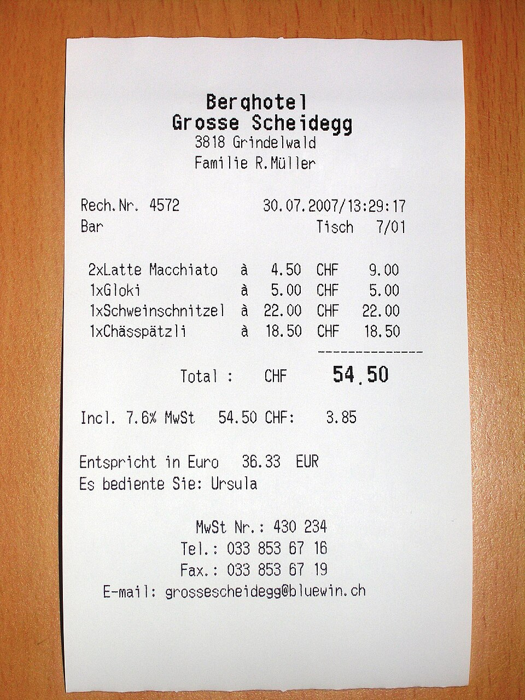

# smart-cfo
An AI-powered web application that acts as your personal Chief Financial Officer. It takes messy, handwritten, or crumpled receipts, uses multimodal AI to read the image, and extracts clean, structured financial data.

##  Features
* **Vision AI Extraction:** Powered by Meta's `Llama-4-Scout` model (via Groq) to accurately read and understand complex, unstructured, and handwritten receipt images.
* **Beautiful UI:** Built with Streamlit for a fast, responsive, and clean user experience.
* **Instant Structuring:** Automatically categorizes data into strict JSON format (Vendor, Date, Total, Currency, Category).
* **CSV Export:** One-click export of your structured data directly into a Pandas-powered CSV for Excel or accounting software.

##  Demo & Results


**The input:**


**The structured output:**


##  Tech Stack
* **Frontend:** Streamlit
* **Backend:** Python
* **AI Engine:** Groq API (Llama 4 Vision)
* **Data Handling:** Pandas, JSON, Base64 Image Encoding

##  How to run it locally

1. **Clone the repository:**
   ```bash
   git clone [https://github.com/YourUsername/smart-cfo.git](https://github.com/YourUsername/smart-cfo.git)
   cd smart-cfo
